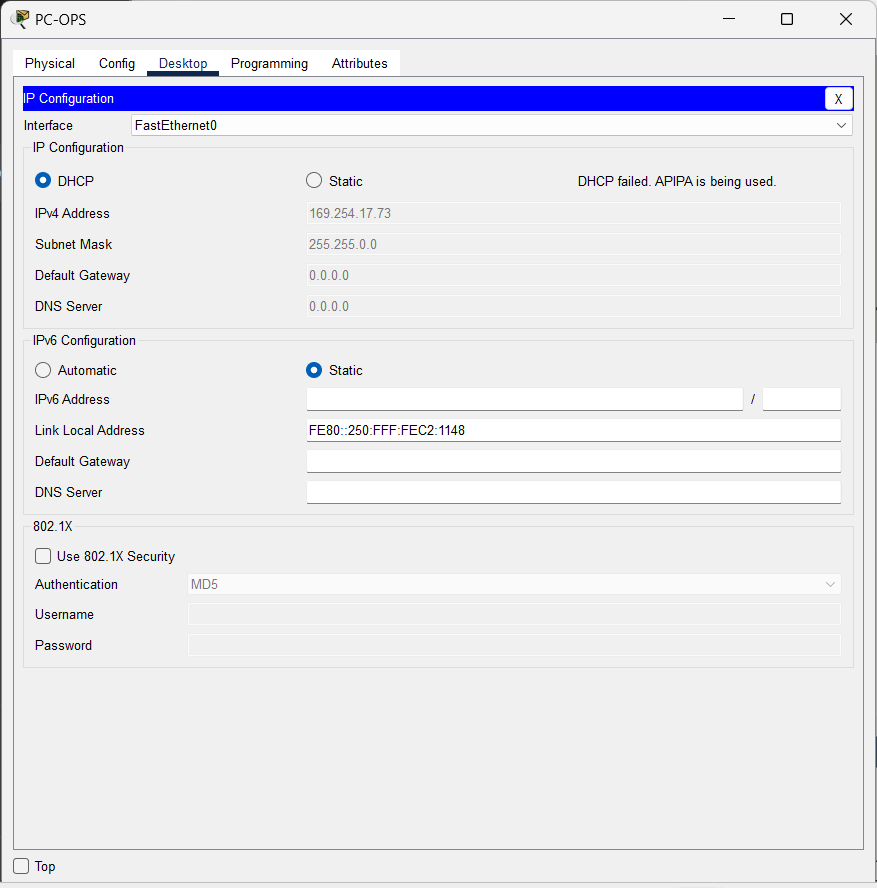
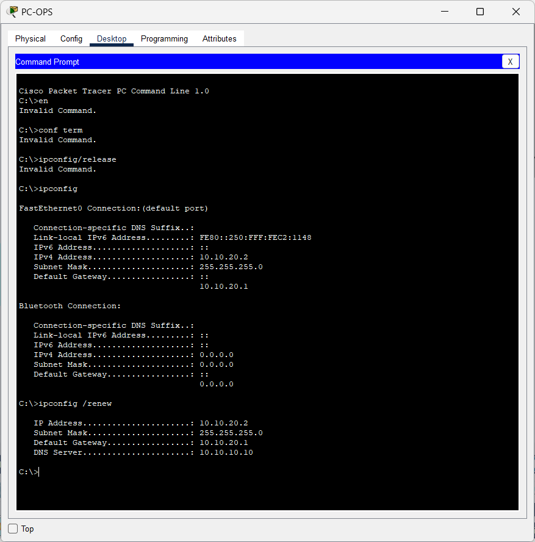
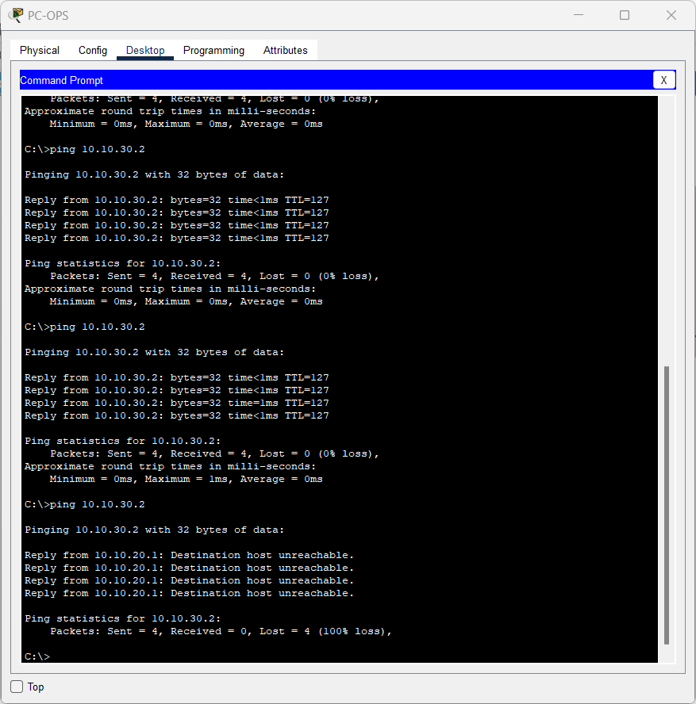
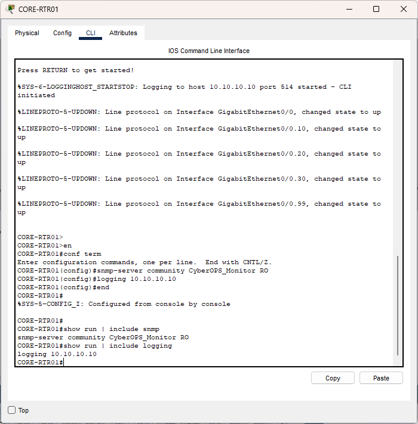
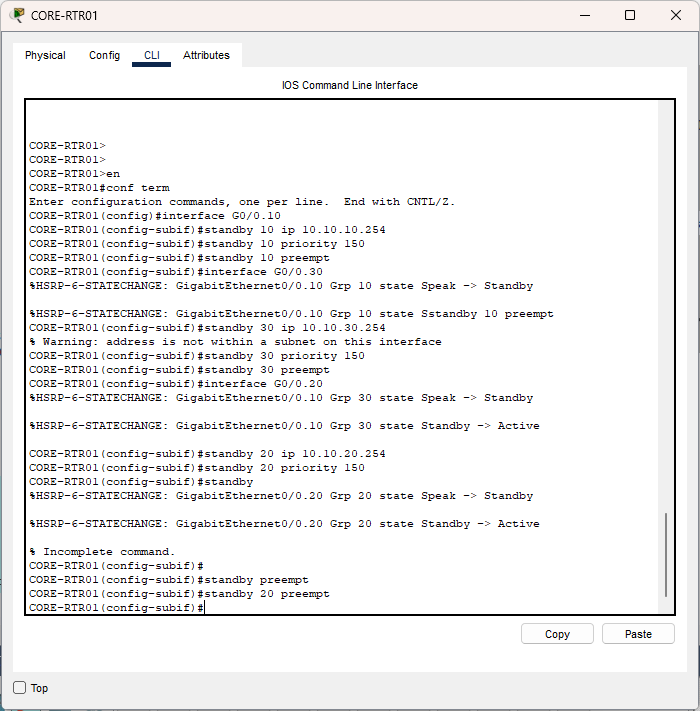
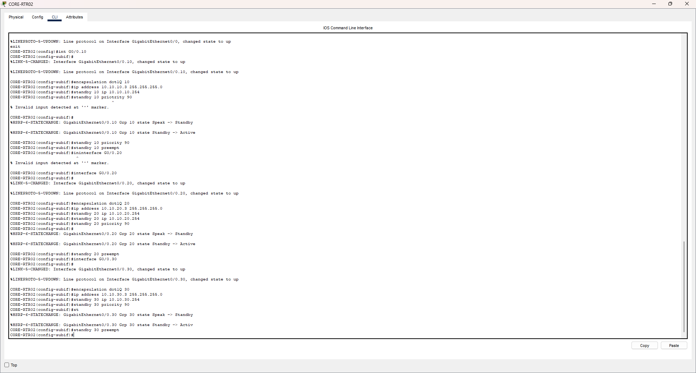
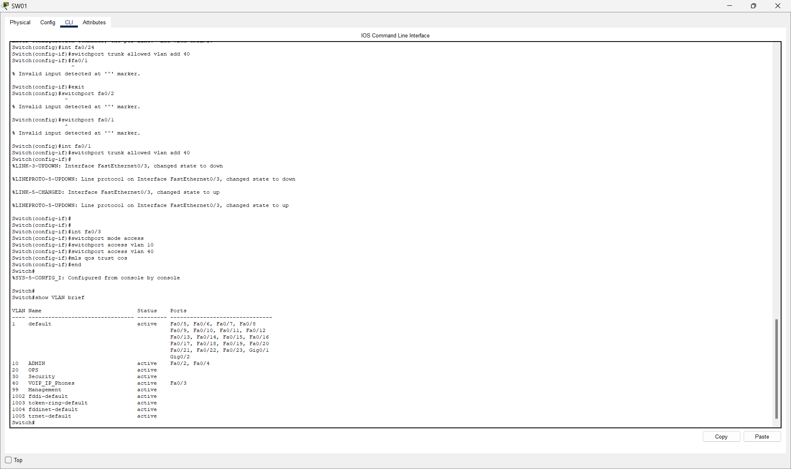
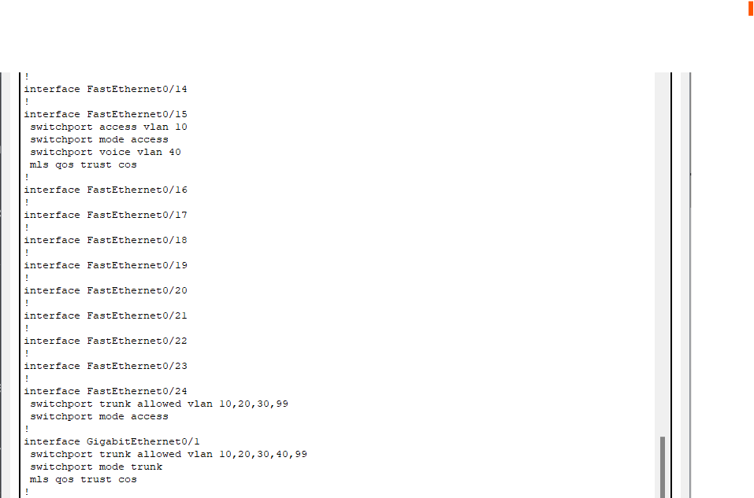
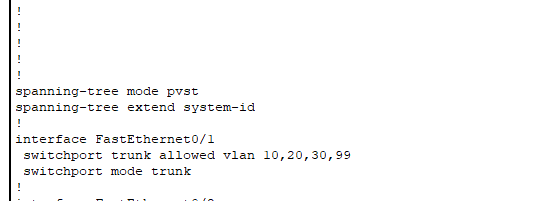

# Enterprise NOC Simulation: Troubleshooting and Defense 🌐

**Author:** Salmata Lamin
**Environment:** Cisco Packet Tracer
**Objective:** Simulate, manage, and troubleshoot an enterprise NOC network with secure VLAN segmentation and inter-VLAN routing.

---

## 🛡️ Executive Summary

This project documents the successful deployment and security hardening of a simulated enterprise network segment. It showcases competency in **VLAN segmentation**, **Inter-VLAN routing (Router-on-a-Stick)**, and **proactive incident response**. The report details the diagnosis and final resolution of a complex inter-VLAN routing failure, the implementation of Layer 3 access control, and the deployment of **High Availability (HSRP)**.

### Key Skills Demonstrated
* **Complex Troubleshooting:** Diagnosing and resolving a persistent Layer 2 trunk negotiation failure that caused a full inter-VLAN routing failure.
* **Traffic Control:** Defining and implementing a restrictive **Extended Access Control List (ACL)**.
* **Proactive Defense:** Configuring **Syslog logging** and **SNMP community strings** for remote management and alert generation.
* **High Availability:** Implementing **HSRP** to ensure core router redundancy.

---

## 🚨 Incident Response and Security Audit

### 1. Inter-VLAN Routing Failure Resolution

A persistent routing failure was observed between VLAN 10 and VLAN 30. The failure was resolved by explicitly correcting the trunk encapsulation (`dot1q`) and VLAN assignments on the switches, restoring full inter-VLAN connectivity.

| Activity | Verification Proof |
| :--- | :--- |
| **Initial Failure State** | Image showing ping from Admin to Ops/Sec failed (100% loss) due to trunk negotiation failure. |
| **Verification of Fix** | Confirmed successful pings between VLANs 10, 20, and 30, restoring inter-VLAN routing. |

### 2. Security Implementation and Verification

Traffic controls, proactive monitoring, and router redundancy were successfully deployed on the core network devices.

| Control | Configuration Summary | Verification Proof |
| :--- | :--- | :--- |
| **Traffic Control (ACL)** | Extended ACL applied **outbound** on `Gig0/0.30` to block traffic from the 10.10.20.0/24 network. | **Verification:** Ping from PC-OPS to PC-SEC **failed (100% loss)**, confirming the ACL is enforced. |
| **Proactive Monitoring** | `snmp-server community CyberOPS_Monitor RO` and `logging 10.10.10.10` configured. | **Verification:** CLI output confirms Syslog destination and SNMP community string are active. |
| **High Availability (HSRP)** | HSRP configured on CORE-RTR01 (Active) and CORE-RTR02 (Standby) for VLANs 10, 20, 30. | **Verification:** `show standby brief` confirms router roles are assigned and the Virtual IP (VIP) is online. |

### 📸 Technical Verification Proofs

| Activity | Proof of Configuration (Image) | Explanation of Screenshot |
| :--- | :--- | :--- |
| **Routing Failure (Initial)** |  | Documents the **initial 100% loss** failure when pinging the Ops VLAN, serving as the official starting evidence. |
| **DHCP Failure State** |  | Documents the **initial DHCP failure** state of the client PC (VLAN 20) during early troubleshooting. |
| **DHCP/VLAN Fix Success** |  | Confirms successful **VLAN 20 connectivity** was restored to the PC after correcting the access port assignment. |
| **ACL Enforcement Proof** |  | Documents the **final, expected failure** (100% loss) after the ACL was applied, proving security policy enforcement. |
| **Monitoring Config Proof** |  | Confirms the **Syslog destination** and **SNMP community string** were set on the Core Router for remote monitoring. |
| **HSRP Router 1 (Active)** |  | Documents the HSRP setup on the **Active** router, showing high priority and the Virtual IP. |
| **HSRP Router 2 (Standby)** |  | Documents the HSRP setup on the **Standby** router, showing lower priority for redundancy. |
| **Initial VoIP Config** |  | Documents the initial configuration for the VoIP access port, including **dual VLAN access (10/40)** and **QoS trust**. |
| **Final Switch Config** |  | Documents the full, final running config on the switch (VLANs, trunks, QoS). |
| **Inter-Switch Trunk Audit** |  | Documents the **inter-switch trunk configuration**, proving Layer 2 path integrity. |
| **VLAN Success Proof** |  | Confirms successful pings between VLANs 10, 20, and 30, restoring inter-VLAN routing. |

---

## 🚀 Next Steps (Ongoing Project)

This project is ongoing. The next phase will focus on implementing security and redundancy measures across the network perimeter and internal segments.

| Priority | Task | Focus Area |
| :--- | :--- | :--- |
| **1. Resilience** | **FHRP Verification:** Conduct failover testing (e.g., shutting down G0/0) to verify HSRP successfully switches the Active role to CORE-RTR02 within the required window. | High Availability / Resilience |
| **2. Management Verification** | **SNMP Server Integration:** Implement the **SNMP server application** on the NOC-SRV01 to verify that the configured community string and Syslog messages are being actively received and processed. | Proactive Defense |
| **3. Advanced Security** | **Advanced ACLs:** Implement stricter, time-based ACLs on the Management VLAN (99) to further restrict administrative access and reduce the attack window. | Security Hardening |
